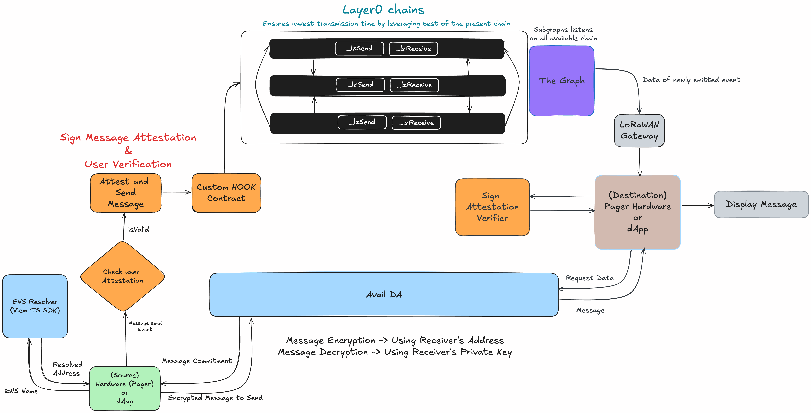

# PageEth
PageEth is a decentralized and privacy preserving hardware and software communication Protocol that is omnichain solution to send and receive messages. It's use case can be extended to the following communications. It can be used to communicate between two IOT devices, between hardware and software and between two Decentralised software applications (dApps).

1. Hardware to Hardware
2. Hardware to Software (dApps)
3. Software to Software (dApps)

PageEth can be used for following types of communications

1. One to One Messaging
2. One to Many Messaging

### Sign Attestation
| chain  | attestation-id |
|------------|------------|
| base-sepolia  | onchain_evm_84532_0x2e9   |

### Layer0 Contracts
| Chain   | Contract   |
|------------|------------|
| Base-Sepolia | 0xd928A87f1653A8E28aa9EE095BeaCaEDC9676A2D |
| Optimism-Sepolia | 0xF919Feb36d20da0590e2b99C479F38c8141EbF9D |
| Polygon-amoy | 0xF214eB925bDAAf31aab7391B025A52180FaaB74f |

### Subgraphs
| Chain   | Subgraph   |
|------------|------------|
| Base-Sepolia | https://testnet.thegraph.com/explorer/subgraphs/AF6x4m16SywZ9jCNs7WjXssRaeMiagEiaKcP6wGEuPqR?view=Query&chain=arbitrum-sepolia |
| Optimism-Sepolia | https://testnet.thegraph.com/explorer/subgraphs/Gjj3mNwuRmAu8tHXdayetxrnuANgwv7M62j11qBmZ7NF?view=Query&chain=arbitrum-sepolia |
| Polygon-amoy | https://testnet.thegraph.com/explorer/subgraphs/FjppeMsowPDo1HpJ6orqHMJDzL78qqoT4RYYHkuAXECx?view=Query&chain=arbitrum-sepolia |

## What is a Pager ?
A pager is a wireless telecommunications device that receives and displays alphanumeric messages. One-way pagers can only receive messages, while response pagers and two-way pagers can also acknowledge, reply to and originate messages using an internal transmitter.

### CAP Codes (Channel Access Protocol)
“Cap Code” stands for Channel Access Protocol code, which is the unique ID code assigned to a particular pager. This code is used to identify the pager and route messages to it. Cap codes are typically entered into the pager by the user or by a paging service provider.

## Problems with Pagers

1. Pagers are rarely encrypted

2. Problem of impersonation

3. Pagers can be abused to perpetrate cyberespionage

4. Centralized servers for Modern Pagers.

5. No prevention of spam messages.

6. once the messages are deleted, no way to retrieve them.

7. Possibility of tampering messages sent or recieved.

8. Big data are not compatible for existing pager system.

## How is PageEth different and better than Pagers ?

PageETH Leverages proof of personhood via Worldcoin verification system, which prevents DOS on our system. Sign attestation process stores a cryptographic commitment of the data on the blockchain,providing verifiable and trustworthy identities. Using Avail blockchain as a data availability layer allows for the decentralized, tamper-proof storage of data, ensuring the integrity and availability of information. Data is sent on multiple blockchains, so no more relying on single centralized server. Our PageETH is a trustless system as once the message is sent from source it's completely on-chain, thanks to LayerZero, and always available (and retrievable) without need to store messages on the hardware device. PageETH also opens up the possibility of creating its own p2p network similar to free overlay network for enabling anonymous communication.

## PageEth Architecture

## PageEth Components and their functions

### Sign User Attestation
* To address the problem that only verified user being able to send message to the network.
* While Onboarding User needs to submit details for attestation and can login once they are verified.
* Before Sending a message through Sign's Service user's attestation needs to be verified.
* A hook contract is triggered during the attestation process, this contract makes the attested data available to all the supported chains, so that it can be queried without relying on a single blockchain.

### ENS Resolution
* Remembering the Address of the recipient is a difficult task. Especially when the sender is a hardware device.
* ENS Resolution helps in resolving the address of the recipient.
* Public address of the recipient is used to encrypt the message and store it on the Avail DA layer.

### Avail DA
* Message could be of variable length and it may create a problem to store very long messages on the blockchain due to congestion issues.
* Avail's ensures that data is always available and can be retieved by the recipient which is same as the sender's data.

### Sign Message Attestation, Custom Hook and Verification
* Messages that contain Avail's data commitments are attested using Sign Message Attestation which makes it easy for the recipient to verify the message and fetch the data from Avail DA.

#### Custom Hook
* Custom Hook contract takes the data from the message and encorporates Sign's Attestation to the message sends the same on the chain.

### LayerZero contracts
* Layer0 contracts ensures that the message is sent to all the configured chains currently `base-sepolia`, `optimism-sepolia` and `polygon-amoy`.
* Each message recieved on each chain is broadcasted to all the other chains using Layer0 in batch send mode.
  

### The Graph
* The Graph is used to index the data and make it available for the recipient to query the data.
